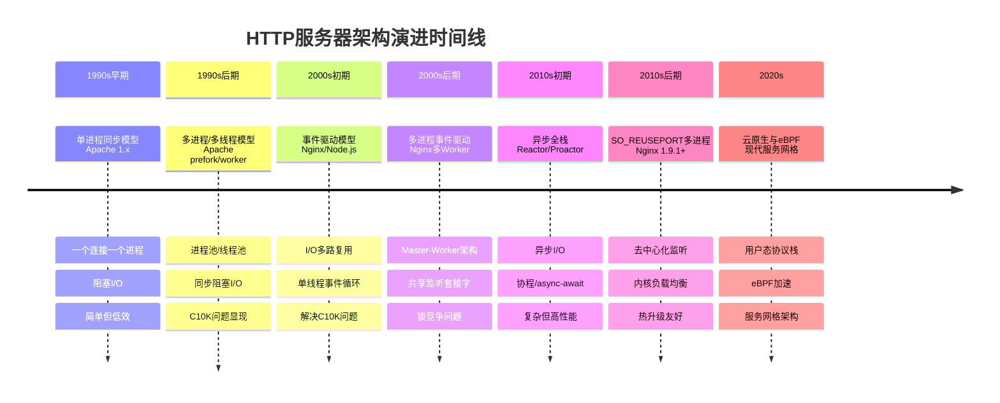

# 生产级 HTTP 服务器架构演进全流程

生产级HTTP服务器架构经历了从简单到复杂、从低效到高性能的完整演进过程。以下是完整的演进路线图：



---

## **阶段1：单进程同步模型（1990s早期）**

### **技术特征**
```c
// 最简化的HTTP服务器
while (1) {
    int client_fd = accept(server_fd, ...);  // 阻塞
    handle_request(client_fd);               // 阻塞处理
    close(client_fd);
}
```

**代表**：早期Apache 1.x、CGI程序

**问题**：
- 一次只能处理一个连接
- CPU大部分时间在等待I/O
- 无法应对多个并发请求

---

## **阶段2：多进程/多线程模型（1990s后期）**

### **2.1 Pre-fork 模型（Apache 1.x/2.x）**
```
主进程 (Master)
    ├── fork() → Worker 1 (处理连接1)
    ├── fork() → Worker 2 (处理连接2)
    └── 预创建进程池
```

**特点**：
- 每个连接一个进程
- 进程隔离，稳定但资源消耗大
- 著名的"C10K问题"：10,000个连接需要10,000个进程/线程

### **2.2 Worker/线程池模型**
```c
// 线程池示例
void *worker_thread(void *arg) {
    while (1) {
        int client_fd = get_from_task_queue();  // 阻塞等待任务
        handle_request(client_fd);
    }
}

int main() {
    // 创建线程池
    for (int i = 0; i < THREAD_POOL_SIZE; i++) {
        pthread_create(&threads[i], NULL, worker_thread, NULL);
    }
  
    while (1) {
        int client_fd = accept(server_fd, ...);
        add_to_task_queue(client_fd);  // 分发任务
    }
}
```

**代表**：Apache Worker MPM、Tomcat

**局限**：
- 上下文切换开销大
- 内存消耗高
- 同步编程模型复杂

---

## **阶段3：事件驱动模型（2000s初期）**

### **Reactor 模式**
```
事件循环 (Event Loop)
    ├── I/O多路复用 (select/poll/epoll/kqueue)
    ├── 事件分发器
    └── 事件处理器
```

**技术突破**：
```c
// epoll 示例
int epoll_fd = epoll_create1(0);
struct epoll_event ev;
ev.events = EPOLLIN;
ev.data.fd = server_fd;
epoll_ctl(epoll_fd, EPOLL_CTL_ADD, server_fd, &ev);

while (1) {
    int n = epoll_wait(epoll_fd, events, MAX_EVENTS, -1);
    for (int i = 0; i < n; i++) {
        if (events[i].data.fd == server_fd) {
            // 接受新连接
            int client_fd = accept(server_fd, ...);
            // 加入epoll监听
            // ... 非阻塞处理
        } else {
            // 处理客户端数据
            handle_client_data(events[i].data.fd);
        }
    }
}
```

**代表**：
- **Nginx**：C语言，epoll
- **Node.js**：JavaScript，libuv（跨平台事件库）
- **Twisted**：Python，事件驱动框架

**优势**：
- 单线程处理数万连接
- 无锁编程
- 高吞吐量

**局限**：
- 无法利用多核CPU
- 计算密集型任务会阻塞事件循环

---

## **阶段4：多进程事件驱动（2000s后期）**

### **4.1 Master-Worker 架构**
```
主进程 (Master)
    ├── 监听端口
    ├── 管理Worker进程
    ├── 热升级支持
    └── 日志收集
  
工作进程 (Worker 1..N)
    ├── 各自的事件循环
    ├── 处理连接
    └── 进程隔离
```

### **4.2 连接分发机制演进**

#### **4.2.1 Accept锁竞争（早期Nginx）**
```nginx
# nginx.conf
events {
    accept_mutex on;  # 使用锁控制accept竞争
    accept_mutex_delay 500ms;
}
```
**问题**：惊群效应，锁竞争

#### **4.2.2 EPOLLEXCLUSIVE（Linux 4.5+）**
```c
ev.events = EPOLLIN | EPOLLEXCLUSIVE;
epoll_ctl(epoll_fd, EPOLL_CTL_ADD, server_fd, &ev);
```
**改进**：内核解决惊群问题，但仍有负载不均衡

#### **4.2.3 共享内存分发**
```c
// Master进程accept连接
int client_fd = accept(server_fd, ...);

// 通过共享内存或管道传递给Worker
int target_worker = select_worker_by_load_balance();
send_fd_via_pipe(worker_pipes[target_worker], client_fd);
```

**代表**：Nginx（传统模式）、Gunicorn

---

## **阶段5：异步全栈架构（2010s初期）**

### **5.1 异步I/O模型（Linux AIO/io_uring）**
```c
// io_uring 示例（Linux 5.1+）
struct io_uring ring;
io_uring_queue_init(ENTRIES, &ring, 0);

// 提交异步accept
struct io_uring_sqe *sqe = io_uring_get_sqe(&ring);
io_uring_prep_accept(sqe, server_fd, NULL, NULL, 0);
io_uring_submit(&ring);

// 处理完成事件
struct io_uring_cqe *cqe;
io_uring_wait_cqe(&ring, &cqe);
int client_fd = cqe->res;
```

### **5.2 协程/纤程模型**
```python
# Python asyncio
async def handle_client(reader, writer):
    data = await reader.read(1024)
    response = await process_request(data)
    writer.write(response)
    await writer.drain()
```

### **5.3 Reactor + ThreadPool 混合模型**
```
主 Reactor (Main Reactor)
    ├── 接收新连接
    ├── 分发到 Sub Reactor
  
子 Reactor 1..N (Sub Reactors)
    ├── 处理I/O事件
    ├── 业务逻辑扔到线程池
  
线程池 (Thread Pool)
    ├── 处理计算密集型任务
    └── 数据库访问等阻塞操作
```

**代表**：
- **Netty**：Java，主从Reactor模型
- **Go**：goroutine + netpoll
- **Tokio**：Rust，异步运行时

---

## **阶段6：SO_REUSEPORT多进程（2010s后期）**

### **架构变革**
```nginx
# nginx 1.9.1+
events {
    reuse_port on;  # 启用SO_REUSEPORT
}

http {
    server {
        listen 80 reuseport;
    }
}
```

### **核心优势**
```c
// 每个Worker进程独立创建监听套接字
int server_fd = socket(AF_INET, SOCK_STREAM, 0);
int optval = 1;
setsockopt(server_fd, SOL_SOCKET, SO_REUSEPORT, &optval, sizeof(optval));
bind(server_fd, ...);  // 绑定相同地址端口
listen(server_fd, ...);

// 内核负载均衡连接
// Worker 1: accept() → 获得连接A
// Worker 2: accept() → 获得连接B
// 内核自动分配，无锁竞争
```

**代表**：
- Nginx 1.9.1+
- Envoy
- Caddy
- 现代云原生应用

**特点**：
- 去中心化，无单点瓶颈
- 内核级负载均衡
- 完美热升级支持
- 每个CPU核心一个Worker，缓存友好

---

## **阶段7：云原生与用户态协议栈（2020s）**

### **7.1 服务网格架构**
```
Sidecar代理 (Envoy/Nginx)
    ├── 每个Pod一个代理
    ├── 零信任网络
    ├── 动态配置
  
控制平面 (Istio/Linkerd)
    ├── 服务发现
    ├── 流量管理
    └── 可观测性
```

### **7.2 用户态协议栈**
```c
// DPDK/用户态TCP/IP栈
struct rte_ether_addr dst_mac;
struct rte_ipv4_hdr *ip_hdr;
struct rte_tcp_hdr *tcp_hdr;

// 直接处理以太网帧，绕过内核
rte_eth_rx_burst(port_id, queue_id, rx_pkts, nb_pkts);
process_tcp_packet(rx_pkts[0]);
```

### **7.3 eBPF 加速**
```c
// eBPF程序，在内核中处理网络包
SEC("xdp")
int xdp_prog(struct xdp_md *ctx) {
    // 在数据包到达协议栈前处理
    void *data = (void *)(long)ctx->data;
    void *data_end = (void *)(long)ctx->data_end;
  
    // 快速路径：直接转发或丢弃
    if (is_http_request(data, data_end)) {
        return XDP_TX;  // 直接转发
    }
    return XDP_PASS;    // 传递给协议栈
}
```

### **7.4 QUIC/HTTP/3 支持**
```rust
// Rust + quiche (Cloudflare)
let mut config = quiche::Config::new(quiche::PROTOCOL_VERSION)?;
config.set_application_protos(b"\x05h3-29\x05h3-28\x05h3-27")?;

let mut conn = quiche::connect(server_name, &scid, &mut config)?;
conn.send(&mut out, out_len)?;
```

**代表**：
- **Envoy**：支持HTTP/3，eBPF过滤器
- **Cilium**：eBPF网络和服务网格
- **Cloudflare**：Rust + QUIC
- **AWS/Nginx**：支持TLS 1.3，0-RTT

---

## **阶段8：智能化与自适应架构（未来趋势）**

### **8.1 自适应负载均衡**
```python
# 机器学习驱动的负载均衡
class AdaptiveLoadBalancer:
    def select_backend(self, request):
        # 考虑因素：
        # 1. 实时延迟监控
        # 2. 请求内容类型
        # 3. 后端健康状况预测
        # 4. 用户地理位置
        prediction = self.ml_model.predict(request)
        return self.backends[prediction]
```

### **8.2 边缘计算架构**
```
客户端
    ↓
边缘节点 (全球分布式)
    ├── 静态内容缓存
    ├── 动态请求路由
    ├── 安全防护 (WAF/DDoS)
  
中心集群
    ├── 核心业务逻辑
    ├── 数据库
    └── 大数据处理
```

### **8.3 无服务器架构**
```yaml
# serverless.yml
functions:
  api:
    handler: handler.http
    events:
      - httpApi:
          path: /{proxy+}
          method: any
    # 自动扩缩容：0 → 1000实例
    # 按请求计费
```

---

## **架构演进总结表**

| **阶段** | **年代** | **核心架构** | **并发模型** | **代表技术** | **吞吐量** | **适用场景** |
|---------|---------|-------------|-------------|-------------|-----------|-------------|
| 1 | 1990s早期 | 单进程同步 | 阻塞I/O | Apache 1.x, CGI | <100 req/s | 静态网站 |
| 2 | 1990s后期 | 多进程/线程 | 同步阻塞 | Apache Prefork/Worker | 1K-5K req/s | 动态网站 |
| 3 | 2000s初期 | 单线程事件驱动 | 异步非阻塞 | Nginx, Node.js | 10K-50K req/s | 高并发API |
| 4 | 2000s后期 | 多进程事件驱动 | Master-Worker | Nginx传统模式 | 50K-100K req/s | 企业级应用 |
| 5 | 2010s初期 | 异步全栈 | 协程/Future | Netty, Go, Tokio | 100K-500K req/s | 实时系统 |
| 6 | 2010s后期 | SO_REUSEPORT | 内核负载均衡 | Nginx 1.9.1+, Envoy | 500K-1M req/s | 微服务网关 |
| 7 | 2020s | 云原生+eBPF | 用户态协议栈 | eBPF, DPDK, QUIC | 1M-10M req/s | 云原生基础设施 |
| 8 | 未来 | 自适应智能 | 机器学习驱动 | AI负载均衡, 边缘计算 | 10M+ req/s | 全球分布式系统 |

---

## **现代生产架构最佳实践**

### **推荐架构（2024年）**
```yaml
# 现代HTTP服务器配置示例
architecture:
  process_model: SO_REUSEPORT  # 每个Worker独立监听
  worker_processes: auto       # 根据CPU核心数自动设置
  event_model: io_uring        # Linux 5.1+，异步I/O

  features:
    - http3: true             # 支持HTTP/3和QUIC
    - zero_copy: true         # 零拷贝优化
    - tcp_fast_open: true     # TCP快速打开
    - bbr_congestion: true    # BBR拥塞控制
  
  observability:
    - metrics: prometheus     # 指标监控
    - tracing: opentelemetry  # 分布式追踪
    - logs: structured_json   # 结构化日志
  
  security:
    - waf: modern_rules       # Web应用防火墙
    - rate_limit: adaptive    # 自适应限流
    - dns_over_https: true    # 安全DNS
```

### **代码示例：现代HTTP服务器核心**
```rust
// Rust + Tokio + Hyper 现代服务器示例
use hyper::service::{make_service_fn, service_fn};
use hyper::{Body, Request, Response, Server};
use std::convert::Infallible;

async fn handle_request(req: Request<Body>) -> Result<Response<Body>, Infallible> {
    Ok(Response::new(Body::from("Hello World")))
}

#[tokio::main]
async fn main() {
    let addr = ([0, 0, 0, 0], 3000).into();
  
    let make_svc = make_service_fn(|_conn| {
        async { Ok::<_, Infallible>(service_fn(handle_request)) }
    });

    let server = Server::bind(&addr)
        .tcp_nodelay(true)      // 禁用Nagle算法
        .tcp_reuseport(true)    // SO_REUSEPORT
        .http2_only(true)       // 强制HTTP/2
        .serve(make_svc);

    if let Err(e) = server.await {
        eprintln!("server error: {}", e);
    }
}
```

---

## **演进规律总结**

1. **从同步到异步**：阻塞I/O → 非阻塞I/O → 异步I/O → 协程
2. **从单核到多核**：单进程 → 多进程 → 多线程 → 多进程事件驱动
3. **从中心化到去中心化**：Master分发 → 内核负载均衡 → 完全去中心化
4. **从内核态到用户态**：内核协议栈 → 用户态协议栈 → eBPF混合架构
5. **从HTTP/1到HTTP/3**：文本协议 → 二进制协议 → UDP(QUIC)多路复用
6. **从手动调优到自适应**：固定配置 → 动态配置 → 机器学习优化
7. **从单体到分布式**：单机服务器 → 负载均衡集群 → 全球边缘网络

## **未来展望**

下一代HTTP服务器架构将围绕以下方向发展：
- **AI驱动的自适应优化**：实时调整配置参数
- **量子安全加密**：后量子密码学支持
- **异构计算**：CPU + GPU + DPU协同处理
- **沉浸式Web**：WebGPU、WebTransport支持
- **绿色计算**：能耗感知的请求路由

生产级HTTP服务器的演进是一个持续优化、适应新硬件和新需求的过程。现代架构需要在**性能**、**可维护性**、**安全性**和**成本**之间找到最佳平衡点。
